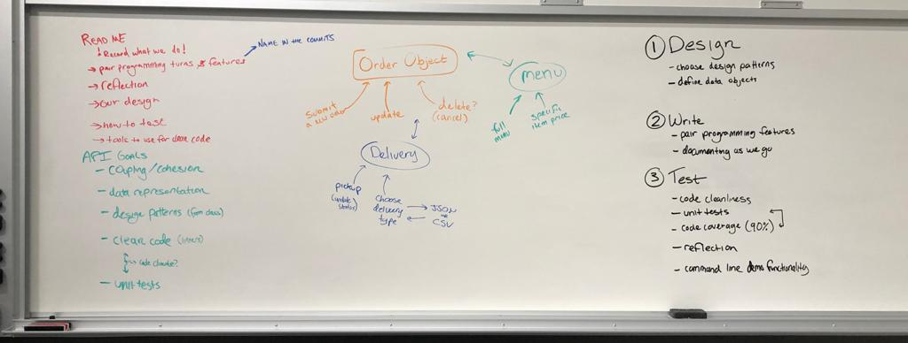
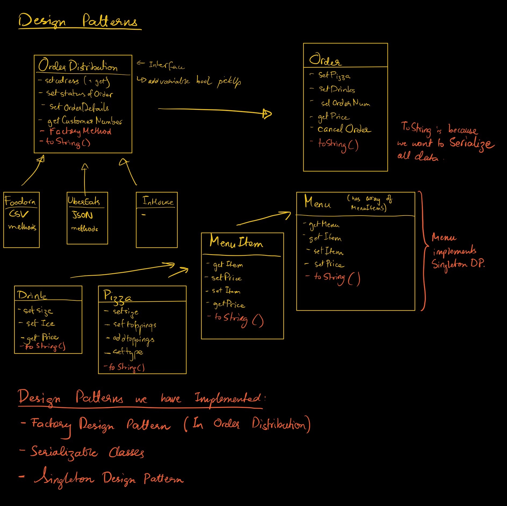

# A2: Pizza Parlour API

## How to run

Run the main Flask module by running `python3 PizzaParlour.py`

Added pylint to vscode

Run unit tests with coverage by running `pytest --cov-report term --cov=. tests/unit_tests.py`

## Roadmap

## Design
Object Oriented (Gives High cohesion): instead of including the delivery information as seperate variables in the order object, it will be a sepearte order_delivery object that is an element of the order object. This means that each class has a single responsibility. 

Factory: There are mutliple types of delivery (uber, foodora, in-house, etc.). Each of these delivery types will be a class that implements the OrderDistribution interface. A factory class will create the OrderDistribution object, filling in the constructor with the proper parameters based off the type (uber: JSON, foodora: CSV, in-house). 

Serialization: For each class we have defined, there is a toString method to serialize the data to JSON. 

Reference: [Uber Menu Integration API](https://developer.uber.com/docs/eats/guides/menu_integration)

### Data Class Diagram

## Criticisms and Limitations of Design Patterns
