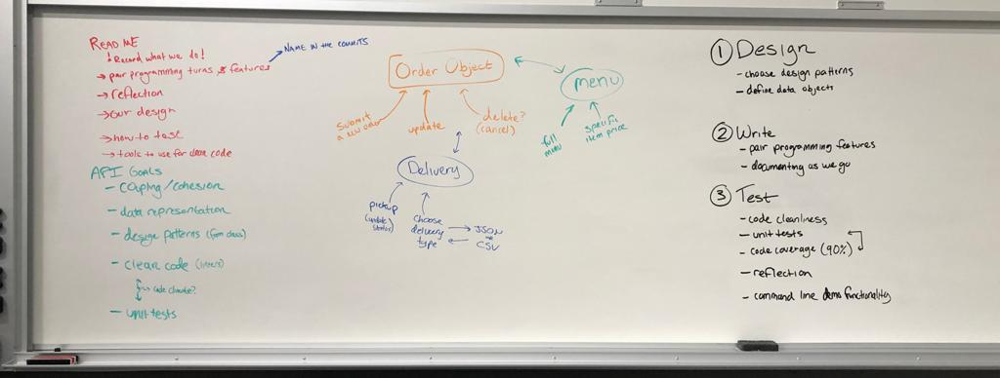
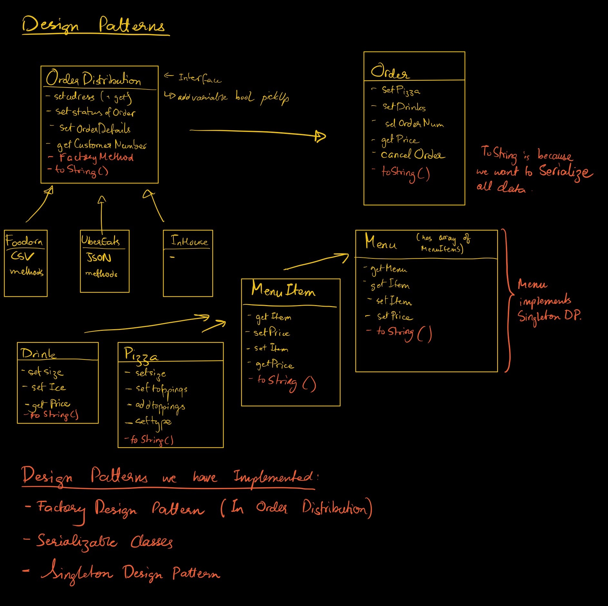

# A2: Pizza Parlour API


## How to run

Run the main Flask module by running `python3 PizzaParlour.py`

Run unit tests with coverage by running `pytest --cov-report term --cov=. tests/unit_tests.py`

## Roadmap


## 1. Design
> _choose design patterns to use and define data objects_

Object Oriented (Gives High cohesion): instead of including the delivery information as seperate variables in the order object, it will be a sepearte order_delivery object that is an element of the order object. This means that each class has a single responsibility. 

Factory: There are mutliple types of delivery (uber, foodora, in-house, etc.). Each of these delivery types will be a class that implements the OrderDistribution interface. A factory class will create the OrderDistribution object, filling in the constructor with the proper parameters based off the type (uber: JSON, foodora: CSV, in-house). 

Serialization: For each class we have defined, there is a toString method to serialize the data to JSON. 

Reference: [Uber Menu Integration API](https://developer.uber.com/docs/eats/guides/menu_integration)

#### Data Class Diagram


#### Criticisms and Limitations of Design Patterns

## 2. Write
> pair program features and document as we go

#### Pair Programming
1. Creating Order class
    - **Driver**: Ryan 
    - **Navigator**: Shardul
    - We didn't know how to define static variables in Python, how to modify static variables in classes
    - How to have the static variables in the init functions.

    - We though that creating a class would be shorter, but there was a little bit of a learning curve as we remembered how to do things in Python. The Navigator, Shardul, helped by looking up references on his computer
    - We also made the collaborative decision to swtich from VSCode to Pycharm so we could use the built-in functionality of linting and other language specific features to help us create clean code. 
    - From here on, we are going to adjust our expectations of what we can get done in a hour of pair programming. The next hour we will spend on creating the MenuItem class and its subclasses of Drink and Pizza. 

2. Creating MenuItem class and Children Drink and Pizza
    - **Driver**: Shardul
    - **Navigator**: Ryan 
    - Should the pizza type be an ENUM? Unfortunately we couldn't have that because the Pizza Parlour should be able to add pizza types. The same can be said about the toppings, so we created a dictionary and list for each of those respectively. The dictionary's key is the pizza type and the value is the price of that particular pizza type. 
    - We externalised our data so that it can be changed globally. All the information is stored in Menu.json now regarding the goods provided by Pizza Parlour.
    - We took advantage of inheritance and the child-parent relationship while creating our classes in this session of pair-programming!
    
3. Switched to Parallel Programming
    - **Ryan**: OrderDistribution interface and foodora, ubereats, and inhouse classes
    - **Shardul**: Testing the classes he has written for MenuItems
    
4. Switched to Back to Pair Programming
    - **Driver**: Shardul
    - **Navigator**: Ryan
    
    
**Pair Programming Reflection** 

We found pair programming to be very productive, especially since the instructions were intentionally vague for the assignment. When pair programming, we could easily discuss our design choices and make changes. This was really important because we could not anticipate every single piece of code that would be needed in the final design. When we encountered a problem that we did not anticipate in the design or tackled errors that required debugging, it was great having two heads to put together to solve the issue. 

The drawback of pair programming was that it felt slower than if we were to program on our own. The features were better designed and implemented, but it was a different pace than we were used to. Instead of "hacking" the entire project together, this was a much more structured process, but took longer than we anticipated. 


## 3. Test
> finalize unit tests and ensure code coverage and cleanliness

We used PyCharm as the IDE to code this project. To Ensure code cleanliness, we used the default Code Style setting for Python and ran the "[Code Cleanup](https://www.jetbrains.com/help/pycharm/reformat-file-dialog.html)" checker on [all the files](https://www.jetbrains.com/help/pycharm/specify-code-cleanup-scope-dialog.html) in the project. From the documentation: 

```
Select this option to run the code cleanup inspections. PyCharm finds and automatically fixes potentially problematic code fragments.
```

We checked the default Code Style settings in Pycharm by navigating to Settings/Preferences -> Editor | Code Style | Python. There are rules set for: 
- Tabs and Indents
- Spaces
- Wrapping and Braces
- Blank Lines
- Imports 

We also checked to see which rules are inforced in Settings/Preferences -> Editor | Inspections | Python. These inspections check semantics, rather than style or syntax. An example of an inspection is the "Dictionary Contains Duplicate Keys". It's documentation contains the following: 

```
This inspection highlights using the same value as dictionary key twice.
```
We enabled these checks and ensured that our code passed all of them. 

